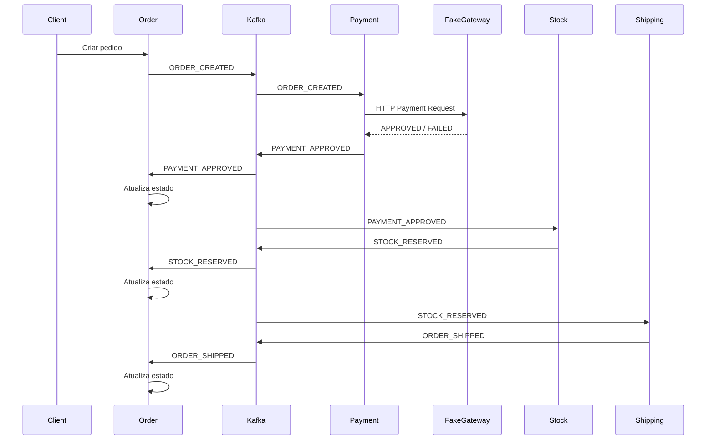

# Spring Order Processing Engine

Sistema de processamento de pedidos orientado a eventos desenvolvido com Java, Spring Boot e Apache Kafka.

O projeto simula um fluxo distribuído de serviços como IFood e Amazon, utilizando comunicação assíncrona entre módulos, processamento de pagamentos via gateway externo e atualização de estados baseada em eventos de domínio.
## Arquitetura

O sistema foi construído seguindo os princípios de:

- Arquitetura de Monolito Modular
- Arquitetura de Microsserviços
- Event-Driven Architecture
- Domain-Driven Design (DDD)
- Comunicação assíncrona com Kafka
- Separação de responsabilidades por domínio
- Processamento orientado a eventos
- Integração com serviços externos
## Fluxo principal


## Principais conceitos implementados

- Domain Events
- Event Choreography
- Kafka Event Bus
- Comunicação assíncrona entre módulos
- Integração com Gateway Externo
- Rule Engine de Pagamento
- Sandbox de Gateway de Pagamento
- Validação de Cartão de Crédito
- Algoritmo de Luhn
- Database Versioning com Flyway
- Swagger/OpenAPI
- Processamento desacoplado por eventos
## Estrutura modular

```
src/main/java/com/lucas/orderapiengine

├── order
├── payment
├── stock
├── shipping
└── _shared
```

### Responsabilidades dos módulos

| Módulo | Responsabilidade |
| :--- | :--- |
| `order` | Criação e gerenciamento do ciclo de vida do pedido |
| `payment` | Processamento e orquestração do pagamento |
| `stock` | Reserva de estoque |
| `shipping` | Fluxo de envio e despacho |
| `_shared` | Componentes compartilhados, Kafka, eventos e infraestrutura |
## Stack

- Java 17
- Spring Boot
- Spring JPA
- Spring Kafka
- PostgreSQL
- Apache Kafka
- Flyway
- Docker
- Swagger / OpenAPI

## Documentação

### Domain Events

As entidades geram eventos de domínio internamente:

```java
order.addEvent(new OrderCreatedEvent(...));
```

O publisher central é responsável por enviar os eventos ao Kafka.

### Arquitetura Orientada a Eventos

Os módulos se comunicam através de eventos Kafka:

- `ORDER_CREATED`
- `PAYMENT_APPROVED`
- `PAYMENT_FAILED`
- `STOCK_RESERVED`
- `ORDER_SHIPPED`
- `ORDER_DELIVERED`

### Fluxo de estados do pedido

O pedido evolui através dos seguintes estados:

```
CREATED
PAYMENT_PENDING
PAYMENT_APPROVED
PAYMENT_FAILED
STOCK_RESERVED
SHIPPED
DELIVERED
CANCELED
```

### Fake Payment Gateway

O projeto inclui um gateway de pagamento separado para simular integrações externas reais.

Características:

- Regras de aprovação/reprovação
- Validação de cartão
- Algoritmo de Luhn
- Simulação de latência
- Sandbox cards
- Integração HTTP síncrona

#### Regras de sandbox

| Card Number | Resultado |
| :--- | :--- |
| 4111111111111111 | APPROVED |
| 4000000000000002 | DECLINED |
| 4000000000009995 | FRAUDE SUSPEITA |
| 5555555555554444 | REVISÃO PENDENTE |


### Estrutura do ecossitema

O projeto é dividido em dois serviços principais:

#### 1. Order Processing Engine

Responsável por:

gerenciamento de pedidos
orquestração do fluxo
publicação/consumo de eventos
integração com o gateway externo

#### 2. Fake Payment Gateway

Responsável por:

simulação de gateway de pagamento
regras de aprovação
validação de cartões
respostas HTTP externas

### Processamento assíncrono

Cada módulo possui consumers dedicados:

- Payment consumers
- Stock Consumer 
- Shipping Consumer
- Order Consumer
- Deliver Consumer
## Como executrar

### Pré-requisitos

- Docker
- Docker Compose

### Subindo infraestrutura

```bash
docker compose up -d
```

O ambiente iniciará automaticamente:

- Order Processing Engine
- Fake Payment Gateway
- PostgreSQL
- Apache Kafka

### Serviços disponíveis

| Serviço | Porta |
| :--- | :--- |
| Order API Engine | `8081` |
| Fake Payment Gateway | `8082` |
| PostgreSQL | `5432` |
| Apache Kafka | `9092` |


### Swagger / OpenAPI

#### Order Processing Engine

``` http://localhost:8081/swagger-ui/index.html ```

#### Fake Payment Gateway

``` http://localhost:8082/swagger-ui/index.html ```
## Exemplo de request

### Criar pedido

```http
POST /api/orders
```

```json
{
  "items": [
    {
      "productId": "mouse",
      "quantity": 2,
      "price": 120
    }
  ],
  "payment": {
    "holderName": "Lucas",
    "number": "4111111111111111",
    "cvv": "123",
    "expiration": "11/2030"
  }
}
```
